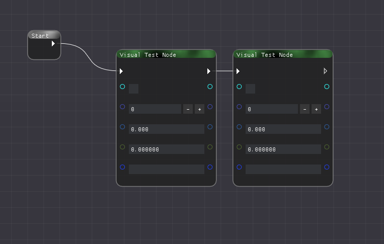
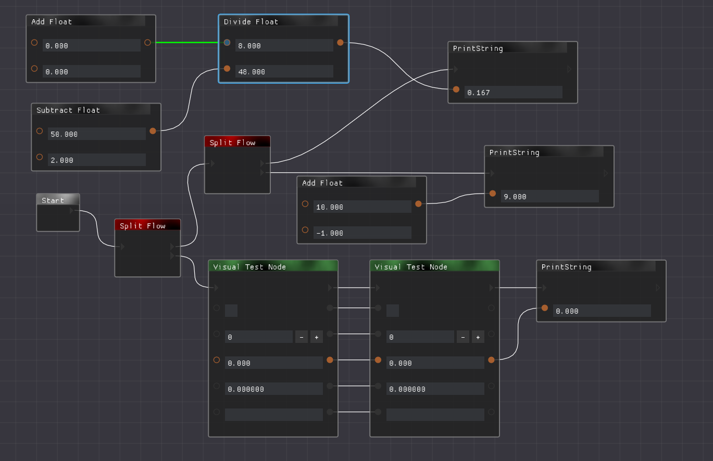
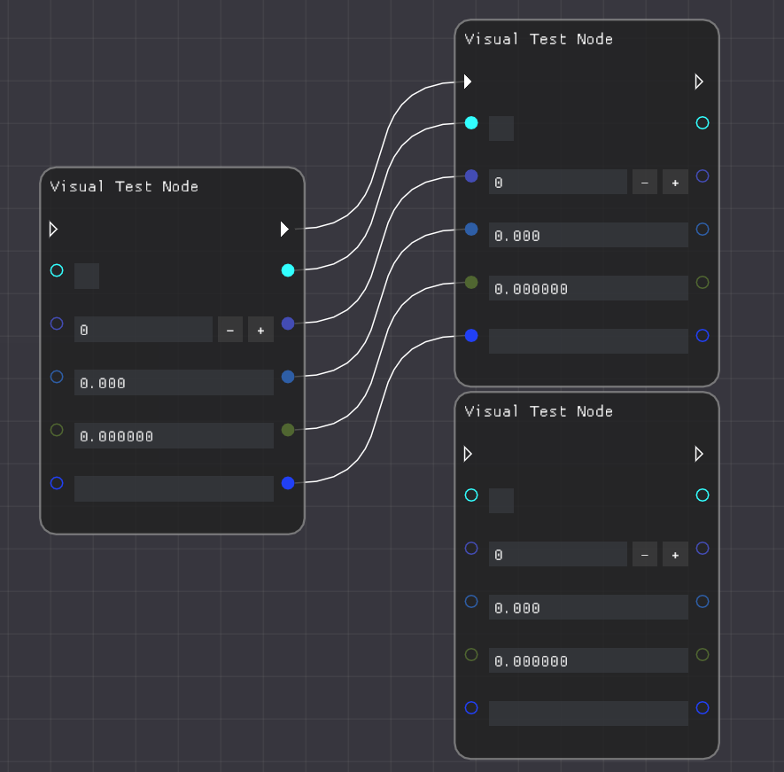
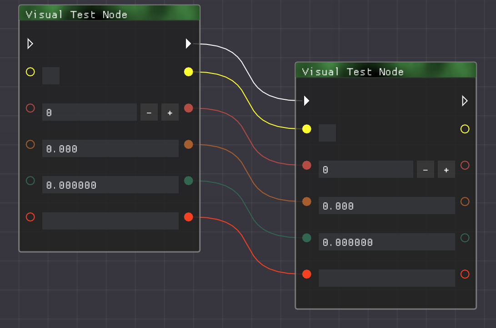

# VisualScripting
Make code using nodes 

This program does the heavy lifting of making nodes work, to make use of this program plugins are required, plugins can be made by deveopers and could make for example:- they could make a plugin to translate the nodes to c++ c# or java or they could even make a plugin to make Overwatch workshop gamemades these features are only limited to the plugin the developers 

## Plugins
Submit a pull request if you have a plugin to add to this list 
| List                                                                                                                    |
| ----------------------------------------------------------------------------------------------------------------------- |
| (Minimal plugin that will show you <br/>how easy it is to setup a plugin)<br/>[Some basic maths](https://github.com/blockout22/VisualScriptingMaths)                                                  |

## Custom Nodes

### Add Nodes using plugins

**Requirements** (See [POM.xml](pom.xml) for full list of dependencies)
* VisualScripting.jar or this repo (repo should be more updated)
* LWJGL which contains GLFW module
* ImGui 
```html
<dependency>
    <groupId>io.github.spair</groupId>
    <artifactId>imgui-java-binding</artifactId>
    <version>${imgui.java.version}</version>
</dependency>
<dependency>
    <groupId>io.github.spair</groupId>
    <artifactId>imgui-java-lwjgl3</artifactId>
    <version>${imgui.java.version}</version>
</dependency>
<dependency>
    <groupId>io.github.spair</groupId>
    <artifactId>imgui-java-natives-windows</artifactId>
    <version>${imgui.java.version}</version>
</dependency>
```
* pf4j
 ```html
 <dependency>
     <groupId>org.pf4j</groupId>
     <artifactId>pf4j</artifactId>
     <version>${pf4j.version}</version>
 </dependency> 
 ```
 
 * Gson
 ```html
 <dependency>
    <groupId>com.google.code.gson</groupId>
    <artifactId>gson</artifactId>
    <version>2.8.9</version>
</dependency>
 ```
 
 ### Making the plugin
* Create a new project with the above Requirements
* Create a new Class that `extends Plugin`   (this can be left as is, it's just required by pf4j)
* Create a new Class that `extends VisualScriptingPlugin`
* Inside the `VisualScriptingPlugin` class in the `init` function you can add your custom Nodes by calling `graphWindow.addNodeToList(InsertCustomNodeNameHere.class);`
* To create an actual Custom node, create a new class that extends `Node` and from that node class you can deside what happens with your node (example below)
* In your MANIFEST.MF you need to include the following `Plugin-Class: <package>.<PluginClass>` `Plugin-Id: <Anything>` `Plugin-Version: 0.0.1` (full example below)

### Examples 

An example of the Plugin class required by pf4j (nothing is used here it's just a requirement for pf4j to load plugins)
```java
import org.pf4j.Plugin;
import org.pf4j.PluginWrapper;

public class VisualScriptingMaths extends Plugin {
    public VisualScriptingMaths(PluginWrapper wrapper) {
        super(wrapper);
    }
}
```

An example of VisualScriptingPlugin class used to add new nodes
```java
import nodes.*;
import visual.scripting.GraphWindow;
import visual.scripting.VisualScriptingPlugin;

public class ScriptMaths extends VisualScriptingPlugin {

    @Override
    public void init(GraphWindow graphWindow) {
        graphWindow.addNodeToList(AddFloat.class);
        graphWindow.addNodeToList(SubtractFloat.class);
        graphWindow.addNodeToList(MultiplyFloat.class);
        graphWindow.addNodeToList(DivideFloat.class);
        graphWindow.addNodeToList(PrintString.class);
    }
}
```

An example of a node that doesn't require the exec function
```java
import imgui.type.ImString;
import visual.scripting.Graph;
import visual.scripting.NodeData;
import visual.scripting.Pin;
import visual.scripting.node.Node;

public class Node_PrintString extends Node {

    private Pin flowIn, strIn, flowOut;

    public Node_PrintString(Graph graph) {
        super(graph);
        //set the name of the node
        setName("Print String");
    }

    @Override
    public void init() {
        flowIn = addInputPin(Pin.DataType.Flow, this);
        strIn = addInputPin(Pin.DataType.String, this);

        flowOut = addOutputPin(Pin.DataType.Flow, this);
    }

    @Override
    public String printSource(StringBuilder sb) {
        NodeData<ImString> data = strIn.getData();

        String strOutput = "\"" + data.value.get() + "\"";

        if(strIn.connectedTo != -1){
            Pin pin = getGraph().findPinById(strIn.connectedTo);
            strOutput = pin.getNode().printSource(sb);
        }

        sb.append("System.out.println(" + strOutput + ");\n");
        return "";
    }
}
```

An example of a node that makes use of the exec function and use of variables 
```java
import imgui.type.ImInt;
import imgui.type.ImString;
import visual.scripting.Graph;
import visual.scripting.NodeData;
import visual.scripting.Pin;
import visual.scripting.node.Node;

public class Node_IntToString extends Node {

    private Pin in, out;

    public Node_IntToString(Graph graph) {
        super(graph);
        //set the name of the node
        setName("IntToString");
    }

    @Override
    public void init() {
        in = addInputPin(Pin.DataType.Int, this);

        out = addOutputPin(Pin.DataType.String, this);

        // call getGraph().getNextLocalVariableID(); to avoid having same variable names in the same function
        String var = "intToString" + getGraph().getNextLocalVariableID();
        //set variable name to let any nodes connect to this pin know what the variable name will be and can reference it
        out.setVariable(var);
    }

    @Override
    public void execute() {
        NodeData<ImInt> inData = in.getData();
        NodeData<ImString> outData = out.getData();

        outData.getValue().set(String.valueOf(inData.value.get()));
    }

    @Override
    public String printSource(StringBuilder sb) {
        NodeData<ImInt> inData = in.getData();
        NodeData<ImString> outData = out.getData();

        //sets the value to the value of the in pin
        String input = String.valueOf(inData.value.get());

        //checks if pin is connected to another pin then changed input string to a variable
        if(in.connectedTo != -1){
            Pin pin = getGraph().findPinById(in.connectedTo);
            //gets the variable name from the connected pin
            input = pin.getNode().printSource(sb);
        }

        String toPrint = "int " + out.getVariable() + " = " + input;
        //add to the source
        sb.append(toPrint + "\n");
        return out.getVariable();
    }
}
```

```mf
Manifest-Version: 1.0
Plugin-Class: com.PluginTest
Plugin-Id: PluginTest
Plugin-Version: 0.0.1
```

 
## Screenshots






## TODO LIST

| TODO                                                                                               | Completed          |
| -------------------------------------------------------------------------------------------------- | ------------------ |
| Nodes update automatically                                                                         | :heavy_check_mark: |
| Convert to source/text                                                                             | :heavy_check_mark: |
| Save/Load nodes from file                                                                          | :heavy_check_mark: |
| Plugin Support                                                                                     | :heavy_check_mark: |
| Hierarchy of current Nodes in graph                                                                | :heavy_check_mark: |
| Workspace design for File Viewer                                                                   | :x:                |
| Improve UI                                                                                         | :x:                |
| Examples                                                                                           | :pinching_hand:    |
| Convert to the more advanced Node Editor More info here https://tinyurl.com/y75w75re               | :heavy_check_mark: |
